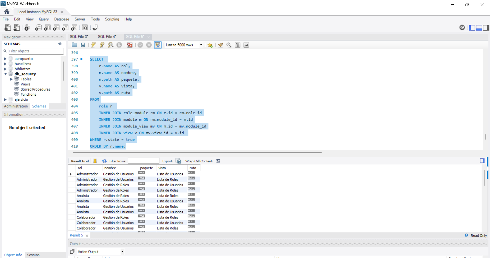

# Caso 1

### (*)
```js
SELECT 
        * 
    FROM 
        role r
    inner join role_module rm ON r.id = rm.role_id
    inner join module m ON rm.module_id = m.id
    inner join module_view mv ON m.id = mv.module_id
    inner join view v ON mv.view_id = v.id
    ORDER BY r.name;
```

### (atributos)
```js    
SELECT 
    r.name AS rol,
    m.name AS nombre,
    m.path AS paquete,
    v.name AS vista,
    v.path AS ruta
FROM
    role r 
    INNER JOIN role_module rm ON r.id = rm.role_id
    INNER JOIN module m ON rm.module_id = m.id
    INNER JOIN module_view mv ON m.id = mv.module_id
    INNER JOIN view v ON mv.view_id = v.id 
WHERE r.state = true
ORDER BY r.name;
```


## img
### (*)   

### (atributos)
