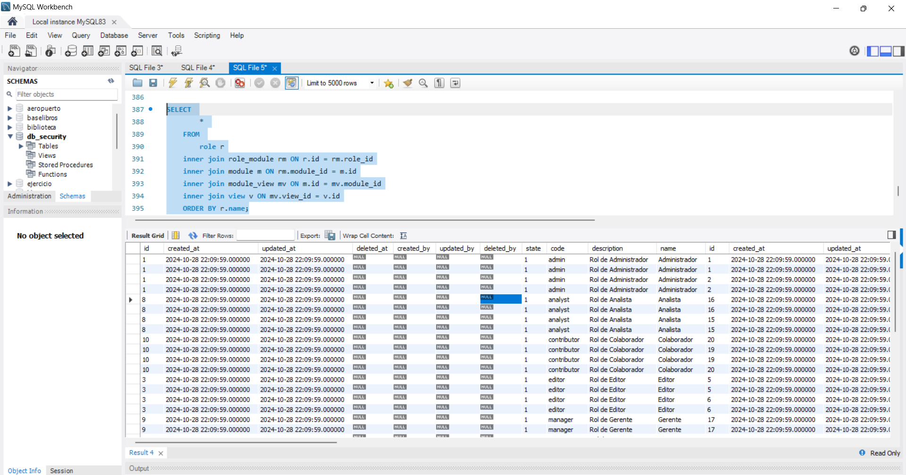

# Caso 1
SELECT 
        * 
    FROM 
        role r
    inner join role_module rm ON r.id = rm.role_id
    inner join module m ON role_module.module_id = module.id
    inner join module_view mv ON m.id = mv.module_id
    inner join view v ON mv.view_id = v.id

### img
